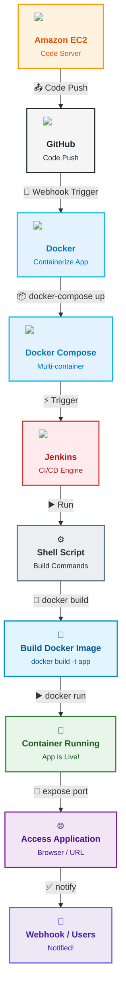

```mermaid
flowchart TD
    EC2["<img src='https://icon.icepanel.io/AWS/svg/Compute/EC2.svg' width='40'/><br/><b>Amazon EC2</b><br/><small>Code Server</small>"]
    GH["<img src='https://cdn.jsdelivr.net/gh/devicons/devicon/icons/github/github-original.svg' width='40'/><br/><b>GitHub</b><br/><small>Code Push</small>"]
    DOC["<img src='https://cdn.jsdelivr.net/gh/devicons/devicon/icons/docker/docker-original.svg' width='40'/><br/><b>Docker</b><br/><small>Containerize App</small>"]
    DC["<img src='https://cdn.jsdelivr.net/gh/devicons/devicon/icons/docker/docker-original.svg' width='40'/><br/><b>Docker Compose</b><br/><small>Multi-container</small>"]
    JEN["<img src='https://cdn.jsdelivr.net/gh/devicons/devicon/icons/jenkins/jenkins-original.svg' width='40'/><br/><b>Jenkins</b><br/><small>CI/CD Engine</small>"]
    SH["⚙️<br/><b>Shell Script</b><br/><small>Build Commands</small>"]
    IMG["🐳<br/><b>Build Docker Image</b><br/><small>docker build -t app</small>"]
    CON["🚀<br/><b>Container Running</b><br/><small>App is Live!</small>"]
    ACC["🌐<br/><b>Access Application</b><br/><small>Browser / URL</small>"]
    WH["🔔<br/><b>Webhook / Users</b><br/><small>Notified!</small>"]

    EC2 -->|"📤 Code Push"| GH
    GH -->|"🔁 Webhook Trigger"| DOC
    DOC -->|"📦 docker-compose up"| DC
    DC -->|"⚡ Trigger"| JEN
    JEN -->|"▶️ Run"| SH
    SH -->|"🔨 docker build"| IMG
    IMG -->|"▶️ docker run"| CON
    CON -->|"🔗 expose port"| ACC
    ACC -->|"✅ notify"| WH

    style EC2  fill:#FFF3E0,stroke:#FF9900,stroke-width:2px,color:#E65100
    style GH   fill:#F5F5F5,stroke:#24292E,stroke-width:2px,color:#24292E
    style DOC  fill:#E3F2FD,stroke:#0db7ed,stroke-width:2px,color:#0277BD
    style DC   fill:#E3F2FD,stroke:#0db7ed,stroke-width:2px,color:#0277BD
    style JEN  fill:#FFEBEE,stroke:#d33833,stroke-width:2px,color:#B71C1C
    style SH   fill:#ECEFF1,stroke:#546E7A,stroke-width:2px,color:#263238
    style IMG  fill:#E1F5FE,stroke:#0288d1,stroke-width:2px,color:#01579B
    style CON  fill:#E8F5E9,stroke:#2e7d32,stroke-width:2px,color:#1B5E20
    style ACC  fill:#F3E5F5,stroke:#7b1fa2,stroke-width:2px,color:#4A148C
    style WH   fill:#EDE7F6,stroke:#6c5ce7,stroke-width:2px,color:#4527A0
```
