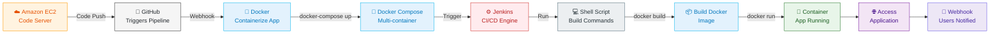

```mermaid
flowchart LR
    EC2["☁️ Amazon EC2\nCode Server"] -->|Code Push| GH["🐙 GitHub\nTriggers Pipeline"]
    GH -->|Webhook| DOC["🐳 Docker\nContainerize App"]
    DOC -->|docker-compose up| DC["🐙 Docker Compose\nMulti-container"]
    DC -->|Trigger| JEN["⚙️ Jenkins\nCI/CD Engine"]
    JEN -->|Run| SH["💻 Shell Script\nBuild Commands"]
    SH -->|docker build| IMG["📦 Build Docker\nImage"]
    IMG -->|docker run| CON["🚀 Container\nApp Running"]
    CON --> ACC["🌐 Access\nApplication"]
    ACC --> WH["🔔 Webhook\nUsers Notified"]

    style EC2  fill:#FFF3E0,stroke:#FF9900,color:#E65100
    style GH   fill:#F5F5F5,stroke:#333,color:#24292E
    style DOC  fill:#E3F2FD,stroke:#0db7ed,color:#0277BD
    style DC   fill:#E3F2FD,stroke:#0db7ed,color:#0277BD
    style JEN  fill:#FFEBEE,stroke:#d33833,color:#B71C1C
    style SH   fill:#ECEFF1,stroke:#546E7A,color:#263238
    style IMG  fill:#E3F2FD,stroke:#0db7ed,color:#0277BD
    style CON  fill:#E8F5E9,stroke:#2e7d32,color:#1B5E20
    style ACC  fill:#F3E5F5,stroke:#7b1fa2,color:#4A148C
    style WH   fill:#EDE7F6,stroke:#6c5ce7,color:#4527A0
```
